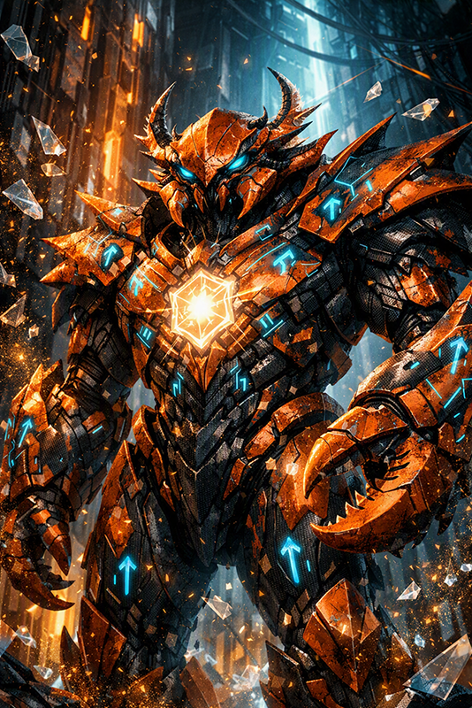

# **Langage Rust**

## **Mini projets**
1. [Calculatrice](../miniProjects/rust/calculator)
2. [Formated nomination](../miniProjects/rust/formatted_nomination)
3. [Persona snipets](../miniProjects/rust/persona_snippet)
4. [RGB2Hexa](../miniProjects/rust/rgba2hexa)

