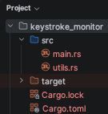
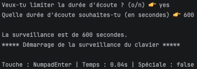

# **Keystroke Monitor — Projet pédagogique**

<div align="center">

 
 
 
 
 

</div>

Ce projet est un **exercice pédagogique** destiné à l'apprentissage langage Rust.  
C'est un moniteur de frappes clavier local, volatile et interactif.  
Ce n'est **en aucun cas** un outil de surveillance destiné à un usage réel sur un poste tiers.
---
## 🧠 **Concepts abordés**

<details>
<summary>Dérouler la liste complète des concepts illustrés</summary>

Concept | Où le trouver dans le code | À quoi ça sert
--:|:-:|---
Les fonctions `fn` | `est_touche_speciale`,<br>`calculer_frequence`,<br>`demander_configuration`
Les point d'entrée du programme `main()` | Dans `main.rs`
Les lignes affichées `println!` / `print!` | | Affichage des frappes et du rapport final
Les commentaires (`//`, `///`, `/* */`) | | Documentation inline sur l'ensemble du code
Les variables mutables (`let mut`) | `compteur_frappes`,<br>`historique`,<br>`touches_precedentes`
Les nombres entiers (`u32`, `u64`, `usize`) | | Compteur de frappes, durée en secondes, index de tableau
Les nombres décimaux (`f64`) | | Calcul de la fréquence de frappe et des timestamps
Les booléens (`bool`) | `est_speciale`,<br>`limite_active`,<br>`en_cours` (via `AtomicBool`)
Les tuples | `(Keycode, f64)` | Associant une touche à son timestamp
Les arrays (`[T; N]`) | `historique: [Option<Keycode>; 5]`, tableau circulaire
Les fonctions à paramètres | `est_touche_speciale(touche: &Keycode)`,<br>`calculer_frequence(nb_frappes, duree)`
Les modules (`mod`, `use`, `pub`) | Séparation `main.rs` / `utils.rs` | Le code est mieux maintenable
La concurrence (`Arc`, `AtomicBool`) | | Gestion propre du signal Ctrl+C
La programmation fonctionnelle<br>(`.filter()`, closures) | | Filtrage anti-rebond<!-- des touches-->

</details>

## ⚙️ **Fonctionnement du programme**
1. **Configuration interactive** : au lancement, l'utilisateur est invité à activer (ou non) une limite de durée, et à en préciser la valeur en secondes.
2. **Capture en boucle** : le programme interroge l'état du clavier toutes les 100 millisecondes via `device_query`.
3. **Filtrage anti-rebond** : seules les touches *nouvellement* enfoncées sont comptées (comparaison avec l'état précédent), évitant de comptabiliser plusieurs fois une touche maintenue.
4. **Arrêt propre** : la boucle s'interrompt soit à l'expiration de la limite choisie, soit immédiatement via `Ctrl+C` (signal intercepté grâce à `Arc<AtomicBool>` et à la crate `ctrlc`).
5. **Rapport final** : affichage du nombre total de frappes, de la fréquence moyenne (frappes/seconde) et des 5 dernières touches enregistrées.
```bash
cargo add device_query ctrlc
cargo run
```



## ⚖️ **Avertissement déontologique et juridique impératif**
La capture systématique de frappes clavier constitue, hors d'un cadre strictement pédagogique et local, est un dispositif assimilable à un **keylogger**.

<details>
<summary>Détail des fondements juridiques applicables</summary>

* **Article 226-1 du Code pénal**  
  👉sanctionne d'un an d'emprisonnement et de 45 000 euros d'amende le fait de porter volontairement atteinte à l'intimité de la vie privée d'autrui, notamment par la captation non consentie de données personnelles [web:109]. Bien que cet article vise historiquement les paroles, l'image et la géolocalisation, la jurisprudence et la doctrine assimilent la captation non consentie de frappes clavier à une atteinte comparable à la vie privée numérique.
* **RGPD (Règlement UE 2016/679)**  
  👉tout déploiement en contexte professionnel engagerait la responsabilité du responsable de traitement en l'absence de base légale (article 6), de défaut d'information des personnes concernées (articles 13/14), et d'absence de limitation de la finalité (article 5.1.b).
* **Recommandations CNIL**  
  👉la surveillance des salariés impose une information préalable, une proportionnalité stricte de la mesure, et l'interdiction de toute collecte généralisée et permanente hors cadre légal justifié.
* **Périmètre de conformité de ce projet**  
  👉ce programme capture exclusivement les frappes de son propre exécutant, sur sa propre machine, en mémoire volatile (RAM), sans stockage disque ni transmission réseau — il ne constitue donc pas un traitement de données personnelles de tiers au sens du RGPD.

</details>

⚠️ Toute réutilisation de ce code _hors du cadre strictement pédagogique et local_ expose son auteur à des **poursuites pénales et à des sanctions administratives significatives**.
